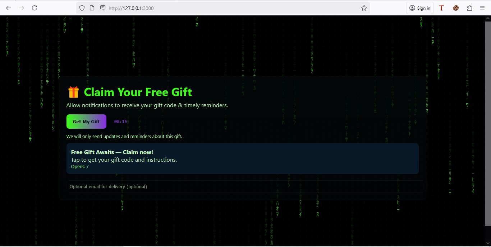
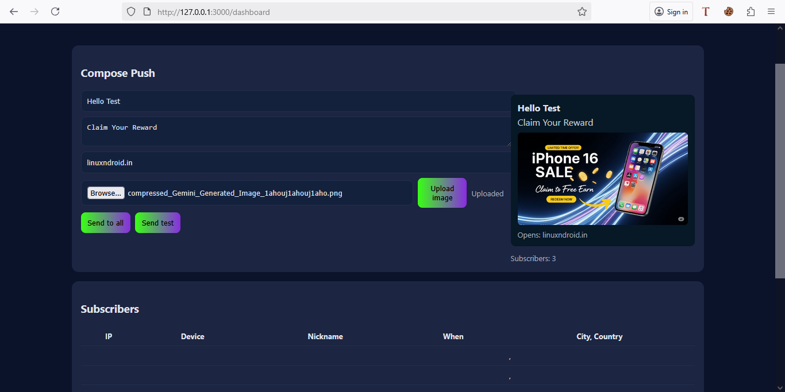

# 📢 Push Notification Dashboard RedTeamer

A **Flask-based Push Notification Dashboard** with:
- 🎨 Matrix-style public landing page for Social-Engineers 
- 🔒 Admin login with push dashboard
- 📊 Support Multi Device, iOS, Android, Windows
- 🌍 GeoIP lookup for subscriber location  
- 🖼️ Image upload with live preview  
- 📬 Push sending using **Web Push Protocol** with your VAPID keys  

---

## 🚀 Features

| Feature | Description |
|---------|-------------|
| 💻 **Landing Page** | Matrix-style animation with subscription prompt |
| 🔑 **Admin Login** | Simple username/password authentication |
| 📤 **Push Sending** | Send to all subscribers or send test messages |
| 🖼️ **Image Upload** | Upload & preview notification images |
| 📊 **Stats & History** | View subscriber list with GeoIP and push history |
| 🌐 **GeoIP** | Automatic city/country detection |
| 📬 **Multi Device** | Support Push Message iPhone, Android, Windows |

---

## 🖼️ Screenshots

**Landing Page**  


**Admin Dashboard**  


---
## 💻 Before Start Change This
- 📬 Change&Paste Your [Vapid](https://vapidkeys.com/) Api ```Line 38,39,40``` in ```App.py``` File
- 🔑 Change Admin Login Data, ```Line 43,44``` Default is ```admin, admin123```
- 🌐 Use HTTPS URL Using Domain or Port Forwarding
  
## ⚡ Quick Start

### 1️⃣ Clone the repository
```bash
git clone https://github.com/YOUR-USERNAME/Push-Notify.git
cd Push-Notify
```
```bash
python -m venv venv
venv\Scripts\activate  # Windows
# source venv/bin/activate  # macOS/Linux

pip install -r requirements.txt
python app.py
```
## 🌐 Use [LocalToNet](https://localtonet.com) For PortForwarding

📊 **After Server Start** 
```bash
landing page Url For User: https://yourlocaltonet.com/
```
```bash
Admin Page Url: https://yourlocaltonet.com/admin
```
Created by:  
**Linuxndroid**

🔗 Stay connected for updates, demos, and new tools!

---

## 🛡️ Legal Notice

This tool is intended **only for authorized use** in testing, education, or red teaming.  
Misuse without consent is strictly prohibited and may violate laws.

---

## 📄 License

This project is licensed under the [MIT License](LICENSE).

# Watch Video For More Information.
[](https://youtu.be/up9fcNwsiqg?feature=shared)

<p align="center">Made with ❤️ By <a href="https://www.youtube.com/channel/UC2O1Hfg-dDCbUcau5QWGcgg">Linuxndroid</a></p>

# Available Our [Hacking Course](https://linuxndroid.in)

# Follow Me on :

[](https://www.instagram.com/linuxndroid)

[](https://www.youtube.com/channel/UC2O1Hfg-dDCbUcau5QWGcgg)

[](https://www.linuxndroid.in)
